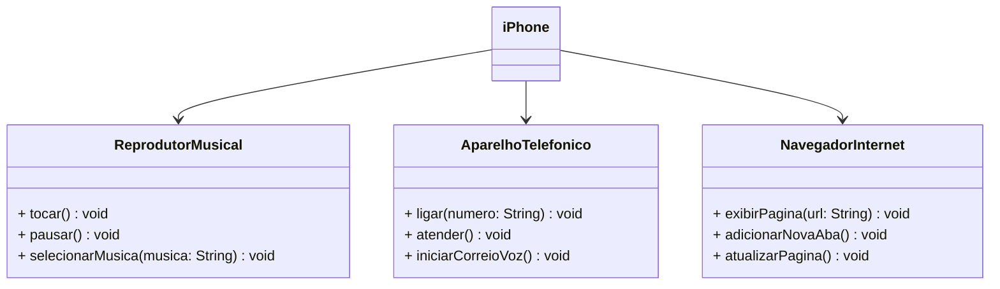

# Modelando o iPhone com UML: Funções de Músicas, Chamadas e Internet

Repositório do lab "Modelando o iPhone com UML: Funções de Músicas, Chamadas e Internet" da Digital Innovation One. 

```mermaid
classDiagram
    class iPhone {
    }

    class ReprodutorMusical {
        + tocar() void
        + pausar() void
		+ selecionarMusica(musica: String) void
    }

    class AparelhoTelefonico {
        + ligar(numero: String) void
        + atender() void
		+ iniciarCorreioVoz() void
    }

    class NavegadorInternet {
        + exibirPagina(url: String) void
        + adicionarNovaAba() void
		+ atualizarPagina() void
    }

    iPhone --> ReprodutorMusical
    iPhone --> AparelhoTelefonico
    iPhone --> NavegadorInternet
```